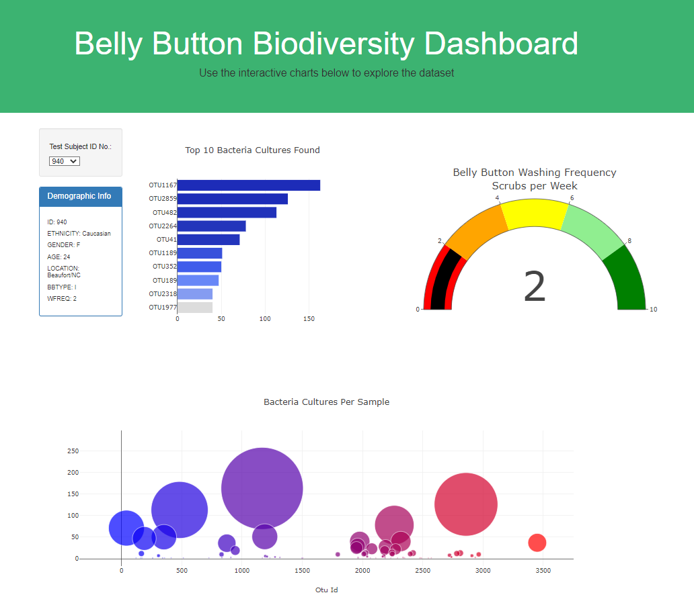

# Plotly Javascript

## Project name: Belly Button Biodiversity Dashboard Visualization
#### My webpage to see the project:
https://daniel89mk.github.io/plotly_chart/

### Purpose of the project:
Roza and I have been working on Improbable Beef Bacterial data and now we need to visualize the bacterial data for each volunteer. 
Our volunteers should be able to identify the top 10 bacterial species in their belly buttons.

### Resoureces
  - Data Sources: samples.json
  - Tools: JavaScript, HTML, D3 

#### The data looks like this:

